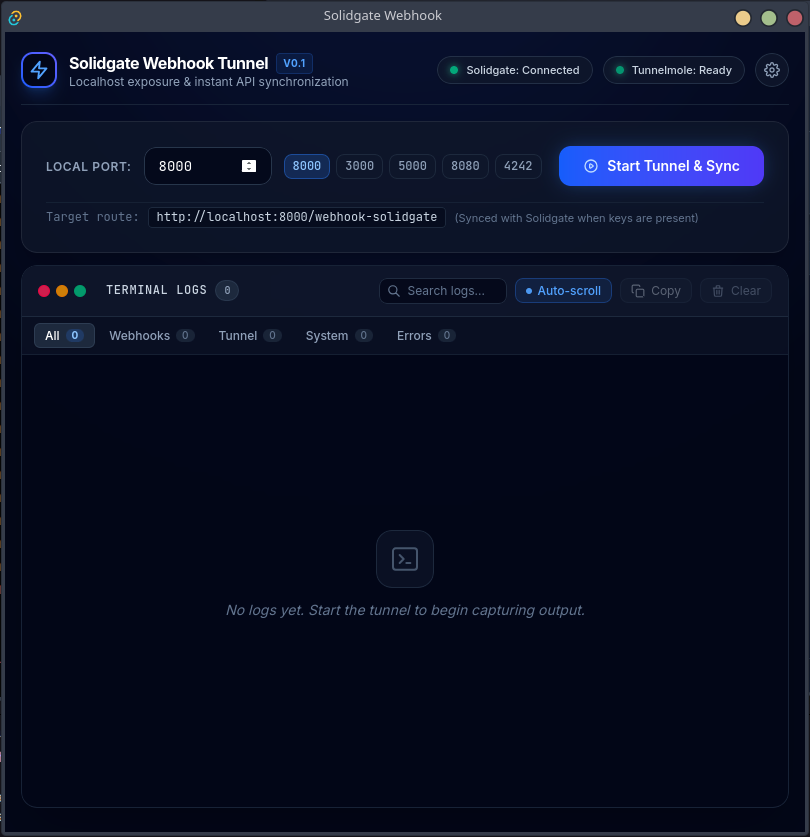
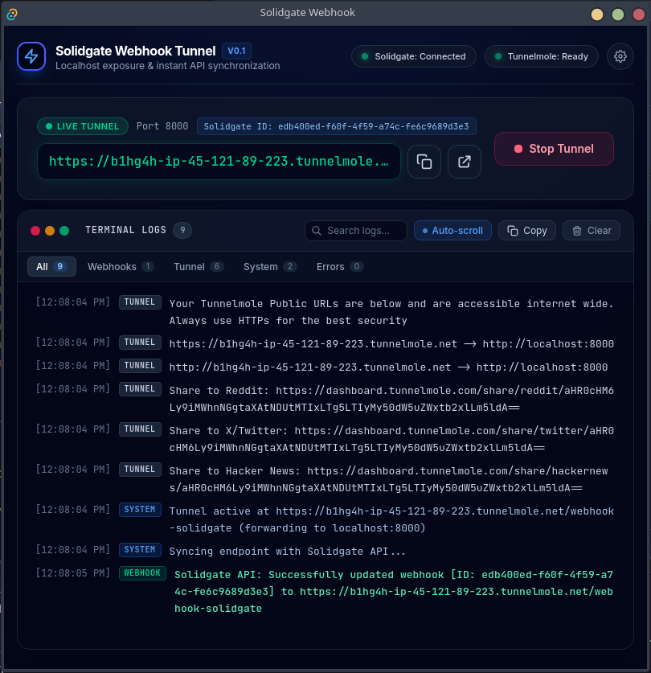

# Solidgate Webhook Tunnel

A powerful, sleek Tauri desktop application designed to streamline testing and integrating Solidgate Webhooks. It acts as a UI wrapper around the [Tunnelmole](https://tunnelmole.com/) CLI to instantly expose your localhost to the internet, while natively syncing the generated URLs with your Solidgate API dashboard.

<div align="center">
  
  <br/><br/>
  
</div>

---

## ⚡ Key Features

### 🌐 Tunnel & Webhook Sync
- **Instant Localhost Tunnels:** One-click generation of secure, public HTTPS URLs forwarding to any local port using `tmole`.
- **Dual Mode (Solidgate & Standalone):** Use it with Solidgate API credentials for automated webhook registration, or without credentials as a fast, clean standalone tunnel tool.
- **Solidgate API Auto-Sync:** Automatically updates existing endpoints or registers new ones with your configured event types in Solidgate the moment the tunnel goes live.
- **Automatic Lifecycle Cleanup:** Automatically deletes temporary endpoints from Solidgate (`DELETE /api/v1/webhooks/endpoints/{id}`) when the tunnel stops, keeping your merchant dashboard uncluttered.
- **Smart Endpoint Auto-Detection:** Automatically detects and suggests existing `.tunnelmole.net` endpoints already registered in your Solidgate account.
- **Embedded Dummy Webhook Server:** Includes an embedded Rust `axum` server running on port `8000` to catch and inspect incoming webhooks without requiring your own backend up front.

### 🛡️ Security & Reliability
- **Secure Backend Cryptography:** Solidgate API signatures (HMAC-SHA512) are computed exclusively inside the Rust backend, preventing your secret keys from ever being exposed to web views or logs.
- **Real-Time Health Status Badges:** Visual indicators in the navbar showing live connectivity to the Solidgate API and presence of the `tmole` binary in your system `PATH`.
- **Non-blocking Validation:** Safely saves API settings and reports connectivity status asynchronously without blocking the user interface.

### 🚀 High-Performance React Terminal
- **RAF Log Batching (`requestAnimationFrame`):** High-frequency log chunks from Tunnelmole and rapid webhook hits are collected into a ref queue and flushed once per frame, sustaining a smooth 60 FPS UI without freezing.
- **Memory-Capped Circular Buffer:** Retains the latest 1,200 log entries to avoid browser memory leaks and DOM scrolling slowdowns during long test sessions.
- **Component & Row Memoization (`React.memo`):** Memoized terminal lines and modal components ensure zero unnecessary re-renders.
- **Smart Non-Blocking Auto-Scroll:** Detects manual scrolling and pauses auto-scrolling when you scroll up to inspect logs, showing a floating `↓ Jump to bottom` button.
- **Search & Category Filters:** Instantly filter logs by text or switch categories: `All`, `Webhooks`, `Tunnel`, `System`, and `Errors` with live count badges.
- **Quick Terminal Actions:** 1-click **Copy Visible Logs** and **Clear Terminal**.

### 🎨 Developer Experience & UI/UX
- **Modern Glassmorphic UI:** Built with React 19, TailwindCSS v4, Inter typography, and JetBrains Mono code fonts.
- **Quick Port Selector:** One-click presets (`8000`, `3000`, `5000`, `8080`, `4242`) with `Enter` key shortcut to launch.
- **Interactive Event Chips:** Clickable tag pills in Settings to toggle Solidgate webhook events without manual comma-separated typing.
- **Secret Key Reveal:** Eye toggle to reveal or mask sensitive API keys.
- **Non-Intrusive Toasts:** Floating toast alerts for clipboard actions, save confirmations, and error notices instead of modal browser dialogs.
- **Browser Opener Integration:** Open active tunnel URLs in your default browser directly via `@tauri-apps/plugin-opener`.

---

## ⌨️ Keyboard Shortcuts

| Shortcut | Action |
| --- | --- |
| `Ctrl + ,` or `Cmd + ,` | Open / Toggle Settings Modal |
| `Enter` (in Port input) | Start Tunnel |
| `Ctrl + Enter` or `Cmd + Enter` | Save Settings (inside Settings Modal) |
| `Escape` | Close Settings Modal |

---

## 📋 Prerequisites

- **Bun** (recommended frontend package manager)
- **Rust & Cargo** (for the Tauri desktop backend)
- **Tunnelmole CLI:** Ensure the `tmole` command is installed and available in your system `PATH`:

  ```bash
  bun install -g tunnelmole
  # Or via curl:
  # curl -O https://tunnelmole.com/sh/install.sh && sudo bash install.sh
  ```

---

## 🛠️ Getting Started

### 1. Install Dependencies

```bash
bun install
```

### 2. Run in Development Mode

```bash
bun run tauri dev
```

This launches the Vite local server and compiles the Tauri desktop app in debug mode with hot reloading.

### 3. Build for Production

```bash
bun run tauri build
```

The compiled native executable and installer packages (deb/appimage/dmg/msi) will be generated in `src-tauri/target/release/bundle/`.

---

## 📖 How to Use

### Mode A: Solidgate Automated Sync
1. Open **Settings** (Gear icon or `Cmd + ,`).
2. Enter your **Solidgate Public Key** and **Secret Key**.
3. Click **Refresh List** to fetch your active endpoints from Solidgate.
4. Select `+ Create New Webhook` (auto-deleted upon tunnel stop) or choose an existing webhook endpoint to overwrite.
5. Select or toggle your desired event types using the quick event chips.
6. Click **Save Settings** (`Cmd + Enter`).
7. Enter your local server port (e.g. `8000`) and click **Start Tunnel & Sync**.

### Mode B: Standalone Tunnel
1. Leave the API keys blank in Settings.
2. Enter your desired local port on the home screen.
3. Click **Start Tunnel & Sync** (runs pure Tunnelmole without API sync).

---

## 🏗️ Architecture & Tech Stack

- **Desktop Framework:** [Tauri v2](https://v2.tauri.app/)
- **Frontend:** [React 19](https://react.dev/), [Vite](https://vite.dev/), [TailwindCSS v4](https://tailwindcss.com/)
- **Plugins:** `@tauri-apps/plugin-opener` (native external browser launcher)
- **Backend / CLI:** Rust, [Axum](https://github.com/tokio-rs/axum) (embedded webhook sink), [Reqwest](https://github.com/seanmonstar/reqwest) (Solidgate API client)
- **Cryptography:** `hmac`, `sha2`, `base64` (HMAC-SHA512 Solidgate request signature generation)

---

## 📄 License

This project is open source and available under the [MIT License](LICENSE).
